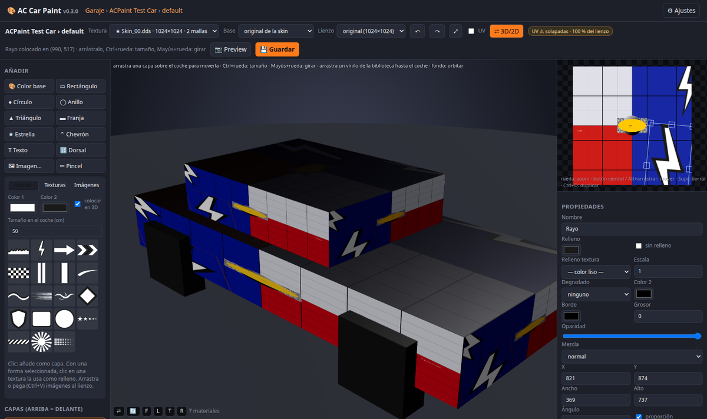

# AC Car Paint — editor de skins para Assetto Corsa

Editor web **local** de skins (liveries) de Assetto Corsa al estilo del editor de vinilos de Forza Horizon:
eliges un coche del garaje, creas o duplicas una skin, **colocas vinilos directamente sobre el coche en 3D**
(arrastrar, girar, escalar) o pintas la textura en 2D por capas, y al guardar se escribe el DDS con mipmaps
en `content/cars/<coche>/skins/<skin>/`, junto con `ui_skin.json`, `preview.jpg` y `livery.png`.
No hace falta Content Manager, Photoshop ni ningún plugin de DDS: el resultado se ve en AC tal cual.



## Requisitos

- Windows con Assetto Corsa instalado (probado con AC 1.16.4 + CSP). También funciona en Linux/macOS
  apuntando a una carpeta `assettocorsa` accesible.
- Python 3.10 o superior (en Windows, marca *Add python to PATH* al instalarlo).
- Un navegador con WebGL (Chrome, Edge o Firefox actuales).

## Instalación y arranque

```bash
git clone https://github.com/alejandrorodm/AssettoCorsaCarPaint
cd AssettoCorsaCarPaint
pip install -r requirements.txt
python server.py            # abre http://localhost:8766
```

En Windows basta con **doble clic en `start.bat`**: instala las dependencias si faltan, arranca el servidor y
abre el navegador. El servidor sólo escucha en tu equipo; ciérralo con Ctrl+C (o cerrando la ventana).

La primera vez indica dónde está Assetto Corsa en **⚙ Ajustes** (la carpeta que contiene `content/cars`,
normalmente `C:\Program Files (x86)\Steam\steamapps\common\assettocorsa`). Si está en la ruta habitual de
Steam se detecta sola. También vale la variable de entorno `AC_ROOT`.

## Cómo se usa

### 1. Garaje y skins

1. **Garaje**: lista de coches con buscador (nombre, marca o id de carpeta).
2. **Skins** del coche: previews y datos de `ui_skin.json`. Desde aquí puedes:
   - **＋ Nueva skin**: crea la carpeta copiando las texturas de otra skin (recomendado: así el coche
     conserva el resto de texturas) o vacía.
   - **Duplicar**, **Datos** (nombre, piloto, dorsal, equipo, país, prioridad), **Zip** (exporta la skin
     lista para compartir, con la ruta `content/cars/...` dentro), **⇪ Importar zip**, abrir la carpeta y borrar.
3. Clic en la preview o en **✏ Editar** para abrir el editor.

> Consejo: nunca edites la skin original de Kunos; duplícala y trabaja sobre la copia. El editor guarda de
> todos modos una copia del DDS original antes de la primera edición (botón **↺ Restaurar original**).

### 2. El editor: modo 3D (estilo Forza)

Por defecto el coche ocupa la zona central y la textura 2D queda en pequeño a la derecha
(botón **⇄ 3D/2D** para intercambiarlos; se recuerda la elección).

| Acción | Cómo |
|---|---|
| Colocar un vinilo | Con la casilla **colocar en 3D** marcada, clic en un vinilo/textura/imagen de la biblioteca y luego **clic sobre el coche**. O simplemente **arrastra el elemento desde la biblioteca hasta el coche**. Ctrl+clic coloca varias copias. |
| Mover una capa | **Arrástrala sobre la carrocería**. El vinilo sigue la superficie y salta de pieza en pieza. |
| Seleccionar | Clic sobre la capa en el coche (se marca con un contorno naranja). Clic en el fondo: deseleccionar. |
| Tamaño | **Ctrl + rueda** sobre el coche (o teclas `+` / `-`). |
| Girar | **Mayús + rueda** (o teclas `[` / `]`, 5° por paso). |
| Orbitar / zoom | Arrastrar sobre el fondo o sobre piezas que no usan la textura · rueda sin modificador · botones **F L T R** (frontal, lateral, cenital, trasera) · 🔄 giro automático. |
| Mover exactamente aquí | **Mayús + clic** lleva la capa seleccionada a ese punto. |
| Soltar una imagen | Arrastra un PNG/JPG desde el explorador hasta el coche: se sube a la biblioteca y se coloca ahí. |

Al colocar desde el 3D el vinilo sale **derecho respecto a la cámara** aunque la isla UV de esa pieza esté
girada o en espejo, y con la anchura real indicada en **Tamaño en el coche (cm)** (el editor calcula la
densidad de téxeles del triángulo tocado). Después puedes afinar posición, ángulo y tamaño en el panel de
propiedades.

### 3. El editor: modo 2D (la textura)

- **Textura**: desplegable con todas las `txDiffuse` del kn5 (★ = ya están en la skin) y las mallas que las usan.
- **Base**: qué se carga de fondo: la textura original de la skin, la del kn5 o ninguna (transparente).
- **Lienzo**: tamaño de la textura que se escribirá (ver más abajo el caso de los coches de un solo color).
- **Añadir**: color base, rectángulo, círculo, anillo, triángulo, franja, estrella, chevrón, texto, dorsal
  (toma el número de `ui_skin.json`), imágenes y pincel.
- **Biblioteca** (pestañas): *Vinilos* (llamas, rayo, flechas, chevrones, bandera a cuadros, franjas, swoosh,
  onda, líneas de velocidad, tribal, rombo, escudo, placa/círculo de dorsal, estrellas, rayas de peligro,
  sol, puntos) con los dos colores elegidos; *Texturas* procedurales (fibra de carbono, hexágonos, panal,
  camuflaje, ajedrez, rayas, metal cepillado, metalizado, cuero, rejilla, chapa…) que se añaden como capa o,
  con una forma seleccionada, como **relleno** de esa forma; *Imágenes*: tu carpeta `library/` (logos y
  vinilos PNG/JPG/SVG), que se llena con ＋, arrastrando ficheros o pegando (Ctrl+V).
- **Propiedades** de la capa: relleno liso / textura / degradado (horizontal, vertical, diagonal, radial),
  borde, opacidad, modo de mezcla (multiplicar, superponer, color…), posición, tamaño, ángulo, voltear,
  **espejo** (duplica al lado contrario de la textura), duplicar, orden, bloquear.
- **UV**: superpone los bordes de los triángulos de las mallas que usan la textura, para saber qué zona es cada pieza.
- Rueda: zoom · botón central o Alt+arrastrar: mover · Supr: borrar · Ctrl+D: duplicar · Ctrl+Z / Ctrl+Y ·
  flechas: mover 1 px (con Mayús, 10).

### 4. Guardar y probar en AC

- **💾 Guardar** (Ctrl+S) escribe el DDS con la cadena de mipmaps y guarda el proyecto por capas en
  `skins/<skin>/acpaint/project.json`, así puedes cerrar y seguir editando después. AC ignora esa carpeta y el
  zip de exportación la excluye.
- **Formato DDS**: por defecto el mismo que el original (DXT1 o DXT5). **Conservar alpha original** está
  marcado porque en la mayoría de coches el canal alpha de la carrocería controla el brillo/reflejo
  (`ksPerPixelMultiMap`); desactívalo sólo si sabes que la textura usa el alpha para transparencia.
- **📷 Preview** genera `preview.jpg` (1022×576) y `livery.png` desde la vista 3D actual.
- En AC (o Content Manager) la skin aparece con el nombre de `ui_skin.json`. Si el juego estaba abierto,
  vuelve a cargar el coche para ver los cambios.

## Coches de un solo color (texturas 1×1 o 4×4)

Muchos coches (Kunos y mods) no llevan una textura de carrocería pintada: la skin es un `car_paint.dds` o
`Skin_00.dds` de **1×1 o 4×4 píxeles** con el color, y el resto (sombras, brillos) lo aportan otras texturas.
Al abrir una de estas texturas el editor **pregunta** qué quieres hacer:

- **Mantener tamaño (sólo color)**: lo seguro y lo que el coche espera. Pon una capa *Color base* con el
  color que quieras y guarda; el DDS sigue siendo de 4×4.
- **Ampliar a 2048 / 4096 (vinilos)**: el lienzo y el DDS pasan a ese tamaño (AC acepta cualquier tamaño
  potencia de 2, sigue siendo una skin normal). Sólo tiene sentido si las mallas de la carrocería tienen un
  **desplegado UV real**; el propio diálogo avisa cuando no es así. El selector *Lienzo* permite cambiarlo después.

Junto al selector de textura aparece un diagnóstico de las UV:

- **UV ✓**: desplegado normal, se puede pintar cualquier cosa.
- **UV ⚠ simétricas**: los dos lados del coche comparten la misma zona de la textura (muy habitual). Un
  vinilo aparece en ambos lados y en uno se ve invertido; usa formas simétricas, o dorsales/logos en el
  capó, techo y trasera.
- **UV ⚠ solapadas**: varias piezas comparten zona; un vinilo puede repetirse en varias.
- **UV ✗ sin desplegado**: todas las mallas apuntan al mismo punto de la textura. Sólo se puede cambiar el
  color; para vinilos habría que re-desplegar el modelo (editar el kn5), que ya no es una skin.
- **⚠ kn5 cifrado/ilegible**: los mods "protegidos" llevan los vértices cifrados o barajados y sólo se ven
  bien dentro de AC con CSP. En el editor el 3D sale como una maraña de triángulos, así que la colocación
  sobre el coche se desactiva (aviso en la vista 3D); sí puedes pintar la textura en 2D y cambiar el color.
  En estos coches una textura ampliada con dibujos suele verse mal en el juego porque no hay forma de saber
  dónde cae cada zona: si sólo quieres otro color, mantén el tamaño original.

## Medidas reales (cm)

Cuando la geometría del coche es legible, el editor calcula cuántos píxeles de textura corresponden a un
centímetro de carrocería. Con eso:

- Las formas nuevas salen con tamaños razonables (rectángulo 60×30 cm, círculo Ø30 cm, texto de 15 cm…).
- El panel de propiedades muestra **Ancho/Alto en cm**, un **deslizador de tamaño** (proporción fija) y un
  **deslizador de ángulo** que actualizan el coche en vivo; el botón **1:1** recupera la proporción original.
- "Tamaño en el coche (cm)" de la biblioteca fija la anchura con la que se colocan vinilos e imágenes, tanto
  al soltarlos sobre el 3D como al añadirlos al lienzo 2D.

Si la geometría no es fiable, todo se muestra en píxeles.

## Estructura del proyecto

- `server.py` (FastAPI, puerto 8766): API REST y estáticos. `acpaint/cars.py` accede a `content/cars`
  (skins, texturas, copias de seguridad, zips); `acpaint/kn5.py` lee el KN5 (v5/v6, jerarquía de nodos,
  plantilla UV y diagnóstico de UV); `acpaint/dds.py` codifica DXT1/DXT5 con mips vía Pillow;
  `acpaint/gltf.py` convierte el kn5 a GLB para la vista 3D; `acpaint/patterns.py` genera las texturas procedurales.
- `web/`: sin build. `app.js` (Fabric.js para el 2D, three.js para el 3D), `index.html`, `style.css`,
  librerías en `web/vendor`.
- Dentro de cada skin editada: `acpaint/project.json` (capas), `acpaint/decals/` (imágenes propias de la
  skin) y `acpaint/original/` (DDS previo a la primera edición).
- `library/`: tus imágenes (global, ignorada por git). `cache/`: GLB, PNG descodificados, patrones y
  plantillas UV; se puede borrar sin miedo.

## Probar sin Assetto Corsa

```bash
python tests/make_fake_car.py                       # crea tests/fake_ac con un coche sintético
AC_ROOT=tests/fake_ac python server.py 8766         # en Windows: set AC_ROOT=tests\fake_ac
```

Se crean dos coches: `acpaint_testcar` (skins `default`, `azul` y `plano`, esta última con textura 4×4 para
probar el flujo de los coches de un solo color) y `acpaint_testcar_enc`, con los vértices barajados y textura
4×4, que simula un mod cifrado (aviso de kn5 ilegible y 3D bloqueado).

## Problemas frecuentes

- **"No encuentro la carpeta de Assetto Corsa"**: elige en ⚙ Ajustes la carpeta que contiene `content/cars`.
- **El coche sale gris o sin textura en 3D**: la textura no está en la skin ni embebida en el kn5; el editor
  la lista igualmente y la crea al guardar.
- **El vinilo aparece en el otro lado del coche o invertido**: UV simétricas (ver arriba).
- **Guardé y en AC no cambia nada**: comprueba que editaste la textura marcada con ★ (la que el coche
  realmente usa) y recarga el coche en el juego; algunos coches usan `Skin_00.dds` para la carrocería y
  `car_paint.dds` sólo para piezas pequeñas.
- **Chrome avisa de `textBaseline`**: Fabric 5.3 usa `alphabetical`; la copia en `web/vendor` está parcheada.
